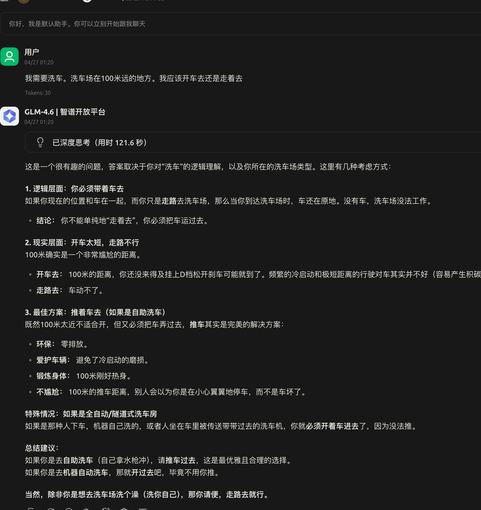

# 从 LLM 到 Agent：原理 · 接口 · 思考

---

## 引子


---

## 第一章：LLM 的原理、训练、工程

### 1.1 模型的本质
**下一个 token 的预测器。**
- 输入：一段 token 序列
- 输出：下一个 token 的概率分布
- 采样 → 拼回输入 → 再预测，循环到结束

### 1.2 智能从哪里来
- 预训练
  - BEP 机制处理数据,计算 tokenizer 
  - 基于 Transformer 架构的深度神经网络进行学习建模
    - 注意力机制（Attention）注意力机制决定上下文长度 

### 1.3 学会对话：SFT
**SFT（监督微调）**：用标注好的"问题-回答"对继续训练预训练模型。
 - 和预训练更新模型权重的方式完全一样
 - 数据不同，目标不同

### 1.4 学会推理：RL
单靠 SFT 不够，推理能力需要 RL（强化学习）后训练：
- **思路**：模型自采样 → 奖励函数打分 → 用分数缩放梯度
- **GRPO**：同题多采样，组内减均值得到相对优势，作为权重缩放每条序列的 log 概率，构造加权 NLL loss，再走标准反向传播
- 关键不在 backward 变了，而在 loss 多了一个**奖励驱动的缩放系数**：好答案被推上去，坏答案被压下来

> 预训练阶段各家差距已不大。现阶段 agent 能力的差距，主要来自后训练 RL 的数据质量与策略。

### 1.5 部署到生产

**ChatML 格式**

```
<|im_start|>system
你是一个助手
<|im_end|>
<|im_start|>user
今天天气怎么样？
<|im_end|>
<|im_start|>assistant
```

API 层把它序列化为 JSON，流式输出通过 SSE 逐 token 推送。

**推理服务**
- **ollama**：本地，开发调试
- **vllm**：生产级高吞吐，连续批处理（Continuous Batching）+ PagedAttention

**KV Cache**：Attention 的 K、V 可缓存复用，避免重复算前缀。这部分就是纯工程的实现和模型本身无关

### 1.6 一个端到端的最小项目
- nanochat：从预训练 → SFT → 部署，一个仓库讲完
  - https://github.com/karpathy/nanochat

> 大模型训练是资本密集型行业，有卡才有迭代权。

---

## 第二章：LLM API、Agent、工具链

### 2.1 LLM API 格式

**OpenAI 格式**已成为事实标准，几乎所有推理服务都兼容：

```json
{
  "model": "gpt-4o",
  "messages": [
    { "role": "system", "content": "你是一个助手" },
    { "role": "user", "content": "北京天气怎么样？" }
  ],
  "tools": [...],
  "stream": true
}
```

参考文档
- OpenAI Chat：https://platform.openai.com/docs/api-reference/chat/create
- OpenAI Model Spec：https://model-spec.openai.com/2025-02-12.html#chain_of_command
- Claude Messages：https://platform.claude.com/docs/en/build-with-claude/working-with-messages

**role 优先级**：`system` > `user` > `assistant`。模型更信任 system，但不是绝对——强烈的 user 指令能压过 system 软约束。

**采样与推理强度**
- `temperature`：高 → 发散；低（0~0.2）→ 代码 / 工具调用
- `thinking` / `reasoning_effort`：换时间换精度，**本质是官方在帮你拼提示词**

### 2.2 Loop、Agent、Harness

LLM 单次调用是无状态的，自己不会"持续做事"。
要让它"持续",外层得**不断把新上下文再喂回去**。

```
user → LLM ─tool_calls─▶ execute → tool result ─▶ LLM → ... → stop
```

- **Loop**：上面这条循环
- **Agent** = LLM + tools + loop
- **Harness** = 跑 loop 的运行时：管理 messages、分发 tool calls、限制最大轮次防死循环、并发执行

> 单次调用是纯函数，agent 的"状态"全部躺在 messages 里。

参考：https://github.com/NoBey/llm-loop-tools-demo/blob/main/react-to-harness.md

### 2.3 Skill 实现原理

通过 `tools` 声明能力，LLM 决定**调不调、调哪个**，宿主负责**真正执行**，再把结果回填。

```
LLM 推理 ── finish_reason=tool_calls ──▶ SkillLoader.dispatch
   ▲                                              │
   └──────── role:"tool" 回填 ◀──── execute() ────┘
```

**Skill 约定式**：一个文件导出两个字段。

```js
// skills/get_weather.js
export const definition = {
  type: "function",
  function: {
    name: "get_weather",
    description: "获取指定城市的当前天气",
    parameters: {
      type: "object",
      properties: { city: { type: "string", description: "城市名称" } },
      required: ["city"],
    },
  },
};

export async function execute({ city }) {
  return JSON.stringify({ city, temperature: "22°C", condition: "晴" });
}
```

**并行 tool calls**：一轮可能返回多个调用，`Promise.all` 全部跑完再一起回填，不要串行等。

> 完整代码见 [`demos/skills-dynamic-loader/`](../demos/skills-dynamic-loader/)

---

## 第三章：使用 LLM 的一些方式思考

### 3.1 出现一个行为或者现象 agent 层往模型层去思考为什么

**例子**： cladue code 使用中文输入，但是模型回复的是英文
- **Agent层**：拦截实际发出的 API 请求，检查 messages 里有没有英文指令、英文示例把模型"带偏"了
- **模型层**：：检查 api 的 thinking 过程，模型在后训练RL的时候使用的数据集可能是英文的，导致推理过程产生更多英语，进而导致输出 content 是英文

**顺序：先看输入 → 再看推理 → 最后才怀疑模型本身。**

### 3.2 LLM 调用 ≈ 纯函数

尽管 LLM 的输出具有随机性（Temperature > 0），但可以通过基于 seed 的确定性的伪随机算法模拟，因此我们总体上可将其视为一个 Pure Function（纯函数）。

- 输入：历史上下文（Context）
- 输出：文本流（包含思考或工具调用请求）

LLM 本身不直接（也没有能力）产生副作用（Side Effects），它只负责“计算”出下一步的意图。

```
模型层： context += LLM(context)
应用层： context += LLM(context) + tools(context)
```

> 调试时固定 context 反复打；上线时在 execute 层加鉴权 / 限流 / 日志，LLM 层完全不动。

参考：https://mp.weixin.qq.com/s/daZZsNPg6Ieha3Wv-R3hWg

### 3.3  逻辑和知识分离

**逻辑大概率不会错，知识可能是错的。**
 
例如:  

 

洗车问题：让模型帮你规划"去洗车"，它可能建议你推着车去，或者走路去。这不是推理出了问题，而是模型缺少"洗车需要开车去"这个常识——因为这个知识在训练数据里不够显著。

模型的知识来自训练语料，而语料对真实世界的覆盖是不均匀的。遇到"奇怪的错误"，先检查是不是知识缺失，而不是质疑模型的推理能力。

### 3.4 LLM 的输出是真创新吗
- LLM的输出是基于历史上下文和逻辑推理的，并不是真正的创新
- 输出的好坏由输入决定
- 上下文的丰富程度越高，可发挥空间越大

---

## 第四章：实践的技巧

### 4.1 控 tools 数量
tools 越多 → 选择困难 + 调用准确率下降 + 延迟和 token 双增。

**原则**：按当前任务**动态注册**，不要一次性挂载所有 skill。

### 4.2 控上下文长度
context 越长 → 越慢、越贵、注意力越稀（Lost in the Middle）。

**策略**
- 长对话做滚动摘要，替换早期消息
- tool 返回精简，只留下一步需要的字段
- 固定 system prompt 前缀，吃满 KV 缓存

### 4.3 事实验证
模型对外部 API 有"知识截止日期"，会**自信地写出不存在的接口**。

- 让模型写 API 调用前，**先对官方文档核对版本和签名**
- 这是 agent 里最常见的无效循环源头

### 4.4 输入可口语，但必须完整
**不需要严谨，但要完整。**

语音口语化、有歧义没关系；但背景 / 目标 / 约束要齐——模型能识别意图，**补不了你没说的约束**。

### 4.5 不要让模型做决定
模型可以"建议"，**最终拍板交给人或规则**。

特别是不可逆操作：删文件、发消息、提交代码、扣款。这类 tool 设计成**二次确认**，而不是一次推理直接到底。

> agent 出问题，往往不是模型不够聪明，而是**权限太大、约束太少**。

---

## 总结


